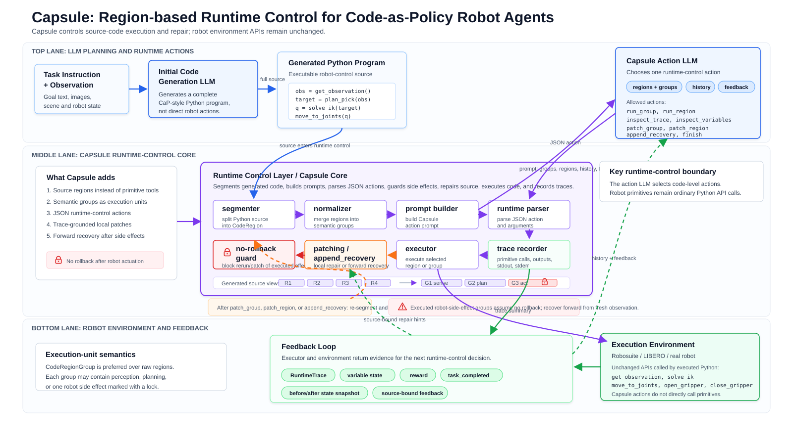

# Capsule Forward Recovery Design

## Goal

Make Capsule runtime-control use no-rollback recovery semantics: once robot code changes
the physical environment, later repairs must continue from the current world state instead
of patching and replaying historical actions.

## Problem

Capsule currently patches source text and then re-segments the program. That is sufficient
for pure Python mistakes, but it is not enough for robot tasks. A group that calls
`move_to_joints`, `close_gripper`, or `open_gripper` has already changed the simulator or
real robot state. Replacing that group's source after execution does not restore object
poses, gripper state, robot joints, controller state, or Python globals.

The current no-rollback prompt and feedback language says repairs should continue from the
current physical state, but runtime behavior still allows the model to patch or rerun an
already-executed side-effect group. That makes the contract advisory rather than enforced.

## Recommended Architecture



Keep source patching for code that has not already changed the world, and add explicit
forward recovery for code that must respond to the current state.

The runtime should track every executed source unit that had robot side effects. After a
side-effect group or region has run, it becomes historical. Without rollback, historical
side-effect units cannot be patched and replayed as though their original preconditions
still hold. If the model needs to recover, it should append new recovery source that starts
from a fresh observation of the current scene.

This keeps one physical-state model across simulation and real robots:

```text
run side-effect group
  -> world changes
  -> feedback warns or fails
  -> append recovery source with get_observation()
  -> regroup source
  -> execute the new recovery group from the current world state
```

## Runtime Actions

Add `append_recovery` as a runtime action.

`append_recovery` accepts:

- `args.source`: executable Python source to append to the generated program.

Validation rules:

- `args.source` must be a non-empty string.
- The source must parse as Python.
- The source must call `get_observation()` somewhere in the appended recovery block.

The action does not execute robot code directly. It appends source, re-segments regions,
rebuilds semantic groups, and returns success with the updated source.

## No-Rerun Guard

The trial loop should track executed side-effect units by region id and group id. Before
dispatching a runtime action:

- `run_group` / `run_region` should be rejected if the target side-effect unit already ran.
- `patch_group` / `patch_region` should be rejected if the target side-effect unit already
  ran.
- Non-side-effect units remain patchable and rerunnable because they do not directly change
  the physical state.

This guard deliberately does not block future source units or newly appended recovery
groups.

## Prompt and Feedback

The Capsule prompt should advertise `append_recovery` and state that recovery code must use
fresh observation because rollback is unavailable. Patch examples should remain available
for local source repair, but the prompt should avoid suggesting that patching historical
robot actions is safe.

Feedback for warnings on side-effect units should recommend `append_recovery` or patching
future code from current state, not rerunning the old unit.

## Error Handling

Invalid recovery source should fail fast before changing the stored program:

- missing `source`: `invalid`
- empty source: `invalid`
- syntax error: `invalid`
- no `get_observation()` call: `invalid`

Attempts to patch or rerun executed side-effect units should return `invalid` with a message
that names no-rollback recovery and recommends `append_recovery`.

## Testing

Unit tests should cover:

- schema support for `append_recovery`;
- prompt documentation for `append_recovery`;
- feedback hints recommending current-state recovery;
- trial-loop rejection of patching already executed side-effect groups;
- trial-loop rejection of rerunning already executed side-effect groups;
- successful `append_recovery` followed by regrouping and execution of the new group;
- invalid `append_recovery` without `get_observation()`.

The focused verification command should run runtime-control schema, prompt, feedback,
config, and trial-loop tests in the prepared WSL project copy.
