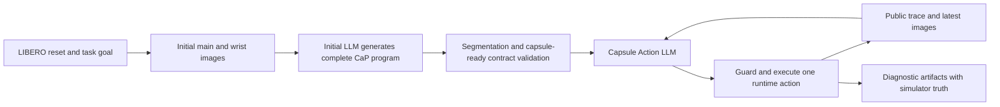

# Standard LIBERO-Object Capsule LLM-Step Design

## Goal

Implement Capsule `llm_step` for the standard `libero_object` suite while keeping the
existing Capsule execution loop and its forward-only side-effect guarantees. The initial
LLM generates a complete Code-as-Policy program. A Capsule Action LLM then chooses one
runtime action per step using compact source context, execution evidence, and current
main-camera and wrist-camera images.

The first server validation target is `libero_object` task 0. The same configuration and
batch path must then cover all 10 standard LIBERO-Object tasks.

## Scope

The implementation will:

- use the non-privileged high-level `FrankaLiberoApi`;
- preserve the existing generic `_run_capsule_llm_step_loop` rather than create a
  LIBERO-specific loop;
- provide current main and wrist images to initial code generation and every Action LLM
  decision;
- support LIBERO's sparse terminal reward without treating every intermediate robot
  action as a lack-of-progress warning;
- keep simulator ground-truth object poses out of LLM prompts while recording them in
  diagnostic artifacts;
- enforce a capsule-ready source contract before physical side effects execute;
- reject premature `finish` actions until the environment success predicate is true;
- add a task-0 configuration and optional task filtering to the LIBERO batch launcher;
- provide local unit coverage that does not require LIBERO, MuJoCo, GPU models, or API
  servers.

The implementation will not:

- expose privileged object poses to either LLM;
- add task-specific `pick_object` or `place_object` skills;
- fork or duplicate the Capsule runtime loop for LIBERO;
- run local Windows experiments or install LIBERO dependencies in the Windows checkout;
- claim task success from visual appearance when LIBERO's success predicate is false.

## Existing Capabilities and Gaps

The repository already provides:

- a generic Capsule `llm_step` loop with semantic groups, patching, append-only recovery,
  side-effect ledgers, and replay prevention;
- compact Action LLM prompts;
- non-privileged RGB-D perception and higher-level motion through `FrankaLiberoApi`;
- main and wrist rendering plus multimodal LLM message support;
- `FrankaLiberoEnv.task_completed()` backed by LIBERO's success predicate;
- declared side-effect functions on `FrankaLiberoApi`.

The current path has several gaps for LIBERO:

1. Capsule reset does not share the normal trial path that replaces
   `{libero_environment_goal}` and collects initial visual feedback.
2. Capsule Action LLM prompts are text-only.
3. Runtime feedback assumes reward growth can verify local progress. Standard LIBERO only
   exposes a sparse terminal success reward.
4. A `finish` action ends the current loop even when the environment is not successful.
5. Runtime state and prompt history do not distinguish LLM-visible state from privileged
   diagnostic state.
6. The existing object-pose snapshot helper recognizes the standard Robosuite wrapper but
   not `FrankaLiberoEnv.handle.env` or its `_get_all_object_poses()` helper.
7. An initial program can hide the complete manipulation inside one effectful helper or
   loop, leaving Capsule no useful phase boundary.
8. The existing LIBERO batch runner cannot directly select only task 0 before expanding
   to the entire suite.

## Architecture



The design adds generic capabilities around the existing loop:

1. shared Capsule trial initialization for dynamic task text and initial visuals;
2. multimodal Action LLM prompt assembly;
3. configurable reward-progress semantics;
4. separate public and diagnostic state views;
5. a source-contract analyzer and execution guard;
6. sanitized multimodal artifacts.

LIBERO enables these capabilities through configuration. Existing Capsule experiments
retain their current defaults.

## Environment and API

The standard task configuration uses:

```yaml
env:
  _target_: capx.envs.tasks.franka.franka_libero_env.FrankaLiberoCodeEnv
  cfg:
    _target_: capx.envs.tasks.base.CodeExecEnvConfig
    low_level:
      _target_: capx.envs.simulators.libero.FrankaLiberoEnv
      suite_name: libero_object
      task_id: 0
      privileged: false
    privileged: false
    apis:
      - FrankaLiberoApi
```

`FrankaLiberoApi` derives object and grasp estimates from RGB-D perception, SAM3, and
GraspNet. It exposes higher-level perception and motion functions without simulator object
truth. Its declared robot side effects are:

- `goto_pose`;
- `goto_home_joint_position`;
- `open_gripper`;
- `close_gripper`.

Although one `goto_pose` call can contain an approach motion through `z_approach`, it is
treated as one API-level atomic effect for Capsule grouping.

## Trial Data Flow

### Initialization

1. Reset with `seed=trial`.
2. Replace the LIBERO goal placeholder with the task language string.
3. Capture current main and wrist images when visual feedback is enabled.
4. Add both images to the initial code-generation prompt.
5. Query the initial LLM for one complete executable Python program.
6. Parse and segment the program into regions and semantic groups.
7. Analyze the program against the capsule-ready contract.
8. Start the Action LLM loop with the initial images as the current visual state.

### Runtime Step

For each runtime step:

1. Build the public pre-action state.
2. Build the existing compact source, history, trace, and side-effect-ledger prompt.
3. Add unresolved source-contract violations.
4. Attach the latest main and wrist images to the final user message.
5. Query the Action LLM for exactly one JSON runtime action, unless a validated appended
   recovery action is already pending.
6. Apply, in order, the source-contract guard, no-replay guard, reward guard, and existing
   recovery constraints.
7. Execute one runtime action.
8. Capture the public post-action state, diagnostic post-action state, and trace evidence.
9. Capture new main and wrist images. These become the current images for the next Action
   LLM decision.
10. Save metrics and sanitized artifacts.
11. Stop immediately when `task_completed()` is true or reward reaches 1.

The implementation does not add a separate VLM summarization call after each action.
Current images are passed directly to the Action LLM, preserving visual evidence and
avoiding an extra model call.

## Multimodal Prompt Design

`build_capsule_prompt()` remains responsible for compact textual context. A separate
prompt-assembly helper attaches:

- a short label for the current main-camera view;
- the current main-camera image;
- a short label for the current wrist-camera view;
- the current wrist-camera image.

The images describe the physical state before the selected runtime action. After an
action executes, the next prompt receives newly captured images.

Text prompt budgeting remains based on the serialized text-only prompt. Image base64 is
not counted against `capsule_action_prompt_char_budget`. Step metrics record image count,
camera names, dimensions, and artifact hashes separately.

Visual action prompts are configurable so text-only LLM-step remains available as an
ablation. If visual feedback is enabled but a required image cannot be captured, the
Action LLM receives an explicit text notice and the step records a visual-capture error;
the loop does not silently present an old image as current.

## Capsule-Ready Program Contract

The program contract is analyzed from the AST using the effect names declared by active
APIs. The first version uses these rules:

- pure computation, geometry, and perception helpers are allowed;
- a user-defined helper that directly or transitively calls a declared robot side effect
  is invalid;
- a `for`, `while`, or `try` statement containing a robot side effect is invalid;
- each executable semantic group may contain at most one declared robot side-effect call;
- source violations include source spans and affected region or group identifiers;
- the complete source is reanalyzed after `patch_region`, `patch_group`, or
  `append_recovery` succeeds.

The intended initial program shape is a top-level phase sequence such as:

```text
observe -> approach -> grasp -> lift -> observe -> place -> release -> verify
```

The contract analyzer reports violations to the Action LLM. While any violation that can
hide or combine robot effects remains unresolved, the contract guard rejects physical
side-effect execution. It still permits:

- `patch_region` and `patch_group`;
- valid `append_recovery` actions;
- `finish` subject to the success guard;
- execution of pure definitions or pure perception groups.

This makes the prompt constraint enforceable rather than advisory.

## State Visibility and Ground-Truth Isolation

State capture is split into two views.

### Public Prompt State

The LLM-visible state can contain:

- reward;
- task completion status;
- simulator/control step counters;
- gripper opening;
- robot joint positions;
- end-effector pose;
- traced API names, arguments, summarized results, failures, and durations.

Perception-derived object or grasp estimates can appear in trace results because they were
returned by an API available to the agent.

### Diagnostic State

The diagnostic view contains the public fields plus object poses obtained from the low
level environment's `_get_all_object_poses()` when available. It is written only to a
diagnostic artifact and is never supplied to either LLM.

The LIBERO configuration selects:

```yaml
capsule_prompt_state_level: proprioceptive
capsule_diagnostic_state_level: full
```

Defaults for existing environments remain unchanged. Prompt history must be constructed
from public states only; adding diagnostic fields to step metrics must not mutate or share
the public dictionaries.

## Sparse Progress and Runtime Feedback

The new progress mode is configured as:

```yaml
capsule_progress_mode: sparse_terminal
```

In `sparse_terminal` mode:

- an exception-free runtime action with reward `0 -> 0` remains successful;
- feedback states that terminal reward has not yet verified task completion;
- it is not labeled as a no-local-progress warning;
- reward 1 or `task_completed=True` is terminal success;
- execution exceptions, invalid actions, guard rejections, and replay attempts retain
  their current explicit statuses.

The existing dense progress behavior remains the default for current experiments.

## Finish and Budget Semantics

LIBERO enables:

```yaml
capsule_require_task_success_for_finish: true
```

When enabled:

- success detected after an executed action terminates the trial immediately without
  another Action LLM call;
- `finish` before environment success is rejected without ending the trial;
- the feedback explains that the environment success predicate is not satisfied;
- the Action LLM may continue, patch, or append forward recovery on the next step;
- reaching `max_capsule_steps` ends the trial as `budget_exhausted`, not as an execution
  exception.

The initial task-0 configuration uses `max_capsule_steps: 24`, allowing room for an
approximately eight-phase nominal program plus patching and recovery.

## Configuration

Create `env_configs/libero/franka_libero_object_0_capsule_llm_step.yaml` with the following
Capsule settings:

```yaml
agent_mode: capsule
capsule_control_mode: llm_step
max_capsule_steps: 24
capsule_execution_granularity: semantic_group
capsule_progress_mode: sparse_terminal
capsule_require_task_success_for_finish: true
capsule_validate_program_contract: true
capsule_action_visual_feedback: true
capsule_prompt_state_level: proprioceptive
capsule_diagnostic_state_level: full
use_visual_feedback: true
use_wrist_camera: true
```

The smoke-test defaults are one model, one worker, and one trial. Parallel ensemble is
disabled so the first results are easier to attribute and reproduce. Server-side command
line arguments may still override model and trial counts.

All new fields must be loaded through the normal configuration path and have backward-
compatible defaults.

## Artifacts

Each Capsule trial records:

- `capsule_code_trial_XX.py`: final source;
- `capsule_trace_trial_XX.json`: actions, events, feedback, trace, and public states;
- `capsule_step_metrics_trial_XX.jsonl`: execution metrics, contract state, visual metadata,
  finish rejection, and budget exhaustion;
- `capsule_diagnostics_trial_XX.jsonl`: diagnostic states containing simulator truth;
- `capsule_prompts_trial_XX.json`: sanitized prompts with no embedded base64;
- `capsule_visuals_trial_XX/step_YY_main.png`;
- `capsule_visuals_trial_XX/step_YY_wrist.png`.

The model request uses data URLs. Before prompt serialization, image content is replaced
with camera name, image path, dimensions, and a content hash. This keeps prompt artifacts
small while allowing exact visual-input auditing.

Artifact write failures are surfaced in the trial log. They do not alter the environment
success predicate, but they make the trial incomplete for experiment auditing.

## Batch Execution

Extend `capx/envs/scripts/run_libero_batch.py` with an optional task-ID filter.

- Selecting task ID 0 runs only `libero_object` task 0.
- Omitting the filter retains the current all-task behavior.
- Invalid or out-of-range IDs fail before launching trials.
- The generated per-task configuration is a deep copy of the Capsule base config.

The base config can therefore be used first for task 0 and then unchanged for all 10
standard LIBERO-Object tasks.

## Error Handling

The loop distinguishes:

- initial syntax errors, recoverable through the existing whole-source fallback and patch;
- source-contract violations, which block physical execution until repaired;
- invalid Action LLM JSON, which records an invalid action and remains within the step
  budget;
- API or Python exceptions, which produce focused source feedback;
- completed side effects, which enter the no-replay ledger even when a later call in the
  group fails;
- visual-capture failures, which are explicit prompt evidence rather than stale images;
- premature finish, which is rejected while environment success is false;
- step-budget exhaustion, which is reported separately from execution failure;
- artifact failures, which mark audit incompleteness without falsifying task success.

Forward-only recovery continues to require a fresh-state observation call and does not
permit historical physical side-effect groups to be replayed.

## Local Test Strategy

Local tests use dummy environments and mocked model/image helpers. They must not import or
start LIBERO, MuJoCo, SAM3, GraspNet, or PyRoKi.

Required coverage includes:

1. pure helpers satisfy the program contract;
2. direct and transitive effectful helpers are rejected;
3. effectful loops and multi-effect groups are rejected;
4. a valid patch clears the relevant contract guard;
5. sparse `0 -> 0` feedback is not a no-progress warning;
6. existing dense feedback behavior remains unchanged;
7. current main and wrist images are attached to Action LLM prompts;
8. missing images are reported and stale images are not reused;
9. prompt artifacts contain no base64 payloads;
10. public prompt history excludes simulator object poses;
11. diagnostic output includes dummy LIBERO object poses;
12. premature `finish` is rejected and a later successful action terminates the trial;
13. task success prevents an unnecessary later model call;
14. the LIBERO goal placeholder is replaced before initial code generation;
15. task-ID filtering selects task 0 and rejects invalid IDs;
16. all new configuration fields load with the intended values and old defaults remain
    compatible.

Per repository policy, Python tests are run in the prepared WSL checkout. Source changes
must first be synchronized from the Windows checkout to `/home/capx/code/cap-x`. No
simulator experiment is required for local implementation acceptance.

## Server Validation Protocol

Server validation is intentionally staged:

1. one task-0 trial to verify environment, multimodal messages, execution, and artifacts;
2. task 0 over five fixed initial states to diagnose stability;
3. all 10 tasks over five states each for small-scale coverage;
4. all 50 official initial states per task only after the protocol is stable.

Recommended comparisons use identical models, APIs, and seeds:

- ordinary multi-turn CaP;
- multimodal Capsule LLM-step;
- Capsule LLM-step with action visual feedback disabled.

Report at least:

- environment success rate;
- Action LLM calls per trial and per success;
- executed groups;
- contract violations and patches;
- append-recovery attempts and outcomes;
- blocked side-effect replays;
- premature finish attempts;
- budget exhaustion;
- visual-capture, perception, planning, execution, and model-format failures.

## Acceptance Criteria

Local implementation is complete when:

- all listed unit tests pass in WSL without external robotics services;
- the new task-0 configuration resolves to standard `libero_object` and
  `FrankaLiberoApi`;
- existing Capsule dense-feedback and text-only paths remain compatible;
- no diagnostic ground-truth field appears in any serialized model prompt;
- no saved prompt contains image base64;
- task 0 and all-task server commands can be generated from the same base configuration.

Task success rate is a server experiment result, not a prerequisite for declaring the
local code implementation complete.
